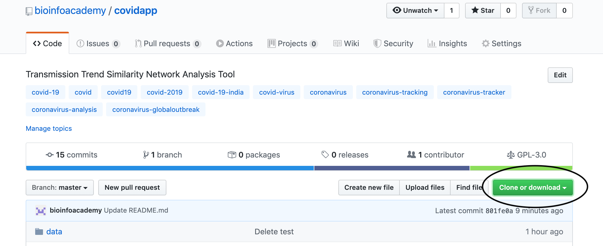

# covidapp
Transmission Trend Similarity Network Analysis Tool

## Requirements
The covidapp is tested working in Mac OS and Debian Linux systems<br>
covidapp needs the following to run successfully;<br>

1. <b>R</b> - https://cloud.r-project.org/ <br>
Download, install and test to make sure you have the latest version of R. You can check for your R install using the below command<br>
```bash
R --version
```
2. <b>Cytoscape</b> - https://cytoscape.org/download.html <br>
Download, install and test to make sure you have the latest version of R<br>
Make sure to note the cytoscape installation folder<br><br>
3. <b>Java</b></br>
Current cytoscpae version needs Java Runtime Environment of 1.8. Make sure you have the correct JVM and that it is in the system path. You can use the below command to check for your JAVA_HOME location<br>
```bash
echo $JAVA_HOME
```
4. <b>PHP</b><br>
Make sure you have a working PHP installation<br>
You can use the below command to check for PHP<br>
```bash
php -v
```
5. <b>Xterm</b><br>
If its not already available, please install xquartz for mac, to use the xterm in Mac OS.<br>
In the debian linux, you can install xterm using the below command;<br>
```bash
sudo apt install xterm
```
## Usage
1. <b>Download</b><br>
If you have git installed in your system, clone the covidapp github repo using the below command;<br>
```bash
git clone https://github.com/bioinfoacademy/covidapp.git
```
You can also just download the project folder as a zip file and unzip it.
<br>
2. <b>Configure</b><br>
From the project 'covidapp' folder, open the config.txt file and edit it to have the correct path for cytoscape.sh, input data file, jdk-path and the attributes file. You could use the example data files in the project 'data' folder to test the app. You can also use the example data files to format your own data files.<br><br>
3. <b>Running</b><br>
With the config.txt file fixed, change to your covidapp directory and run the script using the below command;<br>
```bash
bash covid-pipeline.sh
```
<br>
4. <b>Results</b><br>
The resulting tree image and the network image are written to the covidapp/images folder

## Contributions
Please fork this project, retweek it for your own analysis, publish results, alert relevant officials and save lives. 

## Errors
If you need any help reproducing the test data analysis or retweeking it to fit your own dataset, please feel free to submit an issue in this repository.


